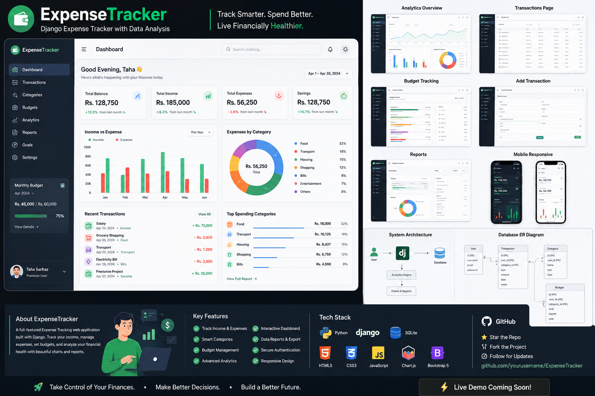

# ExpenseTracker 💰

A multi-user **Django expense tracker and analytics dashboard**: real accounts, full CRUD, budgets, filters, charts driven by your actual data, CSV export and dark mode.



## Features

- **Accounts**: register / sign in / sign out; every record is private to its owner
- **Transactions**: add, edit, delete; search, filter by type, category and date range; pagination; CSV export (formula-injection safe)
- **Dashboard**: this-month income, spending, savings rate and month-over-month change, all computed in the database
- **Analytics**: income vs expense trend (3/6/12/24 months), category mix, auto-generated insights
- **Budgets**: per-category monthly limits with ok / warning (80%) / over-budget states
- **Categories**: custom icon and colour per category
- **UI**: responsive layout with slide-in mobile menu, light/dark theme (follows system, remembers choice), accessible labels and focus states
- **Quality**: 19 automated tests, env-based settings, DB indexes and constraints

## Quick start

```bash
python -m venv venv
source venv/bin/activate        # Windows: venv\Scripts\activate
pip install -r requirements.txt
python manage.py migrate
python manage.py seed_demo      # optional: demo / demo12345 with 6 months of data
python manage.py runserver
```

Open http://127.0.0.1:8000/ and sign in (or create an account).

## Tests

```bash
python manage.py test
```

## Configuration

| Variable | Default | Purpose |
|---|---|---|
| `DJANGO_DEBUG` | `1` | Set `0` in production |
| `DJANGO_SECRET_KEY` | dev key | **Required** when debug is off |
| `DJANGO_ALLOWED_HOSTS` | empty | Comma-separated hostnames |

For production also run `python manage.py collectstatic`, serve behind gunicorn + nginx/WhiteNoise, and switch `DATABASES` to PostgreSQL.

## Structure

```text
config/            settings, root URLs, WSGI
expenses/
  models.py        Category, Transaction, Budget (user-owned, constrained, indexed)
  services.py      DB-side aggregation (totals, monthly series, budgets)
  forms.py         validated, user-scoped forms
  views.py         login-protected views
  tests.py         auth, isolation, CRUD, aggregation, filters, CSV
  management/      seed_demo command
templates/         base, dashboard, transactions, analytics, budgets, categories, auth
static/            app.css (tokens + dark mode), app.js (theme, menu, charts)
```

## Roadmap

REST API · recurring transactions · PDF/Excel reports · budget email alerts · multi-currency · CI pipeline

## License

Add your preferred license before publishing.
